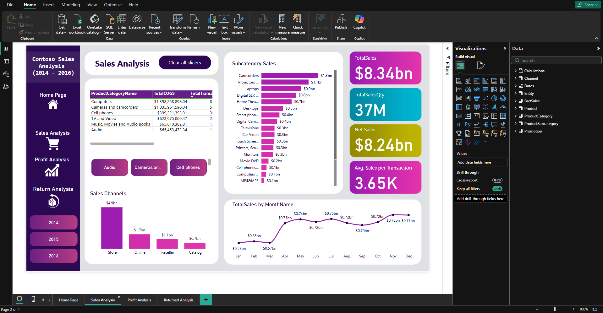
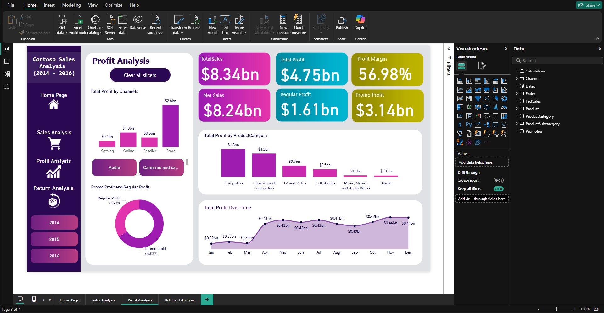
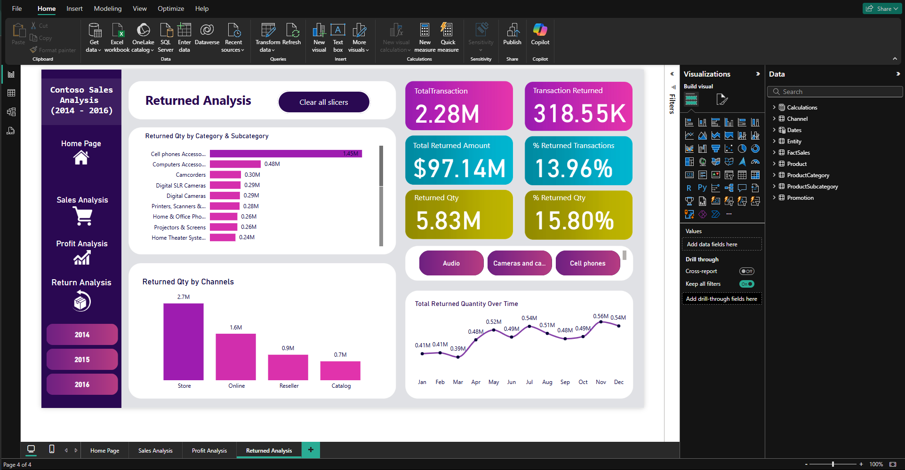

# Contoso Data Analysis (2014 - 2016)

## 📘 Introduction

This project contains an analytical report of Contoso's sales, profits, and returns over a 3-year period. Built using Power BI, the dashboard offers rich visualizations and actionable insights to enhance business decisions.

## 📂 Project Structure

- **📦 Contoso_Analysis.pbix**: The full Power BI report file.
- **📊 dashboards/**: Contains screenshots of the dashboard pages.
- **📄 Contoso_Report_Summary.md**: A detailed markdown report of the analysis and findings.
- **README.md**: Overview of the project.

## 🧠 Problem Solving

The analysis focuses on:
- Evaluating sales and profits across categories and time
- Identifying key trends and seasonal patterns
- Analyzing product return rates

## 🌐 Data Source

- This is a sample Contoso Sales dataset provided by Microsoft. It was downloaded from an Access database and uploaded to Google Drive for easy access: [Download_Here](https://drive.google.com/file/d/1vvxtA0LxEsuk-UC-GjmAlB5xGo1IL4u1/view)

## 🛠️ Tools Used
- Power BI
- DAX for custom measures
- Data modeling & transformation

## 🛠️ Skills & Concepts Demonstrated
PowerBI concepts like:
- Data Visualization (Bar Charts, Columns Charts, KPIs, Table view)
- Report Design in Power BI
- Developing general DAX calculations that deal with text and numbers
- Data Modelling
- Data Cleaning
- Measures
- Filters
- Tooltips
- Buttons
- Creating columns
- Slicers
- Drilldown
- Craeating Relationships

## 📈 Key Insights

### 🔹 Sales
- **Total Sales**: $8.34bn
- **Top Channels**: Store ($4.9bn), Online ($1.7bn), Reseller ($1.1bn) and Catalog ($0.7bn)
- **Top Subcategories**: Camcorders ($1.3bn), Projectors ($1.1bn), Laptops ($0.9bn) ...

### 🔹 Profit
- **Total Profit**: $4.75bn
- **Profit Margin**: 56.98%
- **Promo vs. Regular Profit**: Regular Profit ($1.61bn), Promo Profit ($3.14bn)

### 🔹 Returns
- **Total Returned Quantity**: 5.83Millions
- **percentage of Return Quantity**: 15.80%
- **Top Returned Items**: Accessories for cell phones 

## 🔍 Recommendations

1. Investigate the causes of all returned product categories.
2. Evaluate the effectiveness of promotions.
3. Optimize in-store experience to reduce return rates.
4. Leverage monthly sales trends for campaign planning.

## 📊 Dashboard Previews

| Sales Analysis | Profit Analysis | Returned Analysis |
|----------------|------------------|------------------|
|  |  |  |

---

💼 Developed by [Stephen Adeniyi](https://github.com/SteevAnalytics/) || 📅 2025

